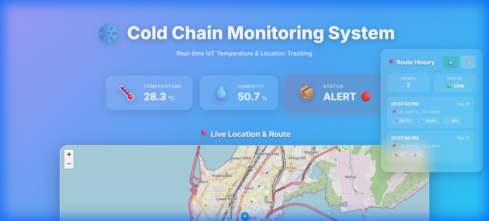

# ❄️ Sanika IoT Dashboard

A stunning real-time IoT Cold Chain Monitoring Dashboard built with React, Firebase, and Leaflet. Track temperature, humidity, and GPS location with beautiful glassmorphism design and route history visualization.

## 🚀 Live Demo

**[View Live Dashboard →](https://cold-chain-iot.vercel.app/)**



---


## 🌟 Features

### Real-Time Monitoring

- 🌡️ **Temperature Tracking** - Live temperature monitoring with alert thresholds
- 💧 **Humidity Monitoring** - Real-time humidity percentage display
- 📦 **Status Alerts** - Color-coded status indicators (SAFE 🟢 / ALERT 🔴)
- 📍 **GPS Location** - Live device location tracking on interactive map

### Route History

- 📊 **Path Visualization** - Polyline showing complete route history
- 🔵 **Waypoint Markers** - Color-coded markers for start, waypoints, and current position
- ⏱️ **Timestamps** - Detailed time tracking for each position
- 📏 **Distance Calculation** - Automatic distance calculation between points
- 💾 **Persistent Storage** - Route history saved in localStorage
- ⏸️ **Tracking Controls** - Start/stop tracking and clear history

### Premium Design

- 🎨 **Animated Gradient Background** - Dynamic multi-color gradient animation
- ✨ **Glassmorphism Effects** - Modern frosted glass UI components
- 🎭 **Micro-Animations** - Smooth transitions and hover effects
- 📱 **Responsive Design** - Works beautifully on mobile, tablet, and desktop
- 🎯 **Custom Scrollbars** - Styled scrollbars matching the theme

## 🚀 Tech Stack

### Frontend

- **Framework:** React 18.3.1
- **Build Tool:** Vite 6.0.5
- **Mapping:** Leaflet + React-Leaflet
- **Styling:** CSS3 with custom properties
- **Fonts:** Google Fonts (Inter)

### Backend

- **Database:** Firebase Realtime Database
- **Hosting:** Vercel

### Hardware (IoT Device)

- **Microcontroller:** ESP32
- **Sensors:** DHT22 (Temperature/Humidity), NEO-6M GPS
- **Display:** SH1106 OLED (128x64)
- **Language:** Arduino C++

## 📦 Installation

1. **Clone the repository**

   ```bash
   git clone https://github.com/sanikamalave25/Sanika-Iot-Dashboard.git
   cd Sanika-Iot-Dashboard
   ```

2. **Install dependencies**

   ```bash
   npm install
   ```

3. **Configure Firebase**

   Create a `.env.local` file in the root directory:

   ```env
   VITE_FIREBASE_API_KEY=your_api_key
   VITE_FIREBASE_AUTH_DOMAIN=your_project.firebaseapp.com
   VITE_FIREBASE_DATABASE_URL=https://your_project.firebaseio.com
   VITE_FIREBASE_PROJECT_ID=your_project_id
   VITE_FIREBASE_STORAGE_BUCKET=your_project.appspot.com
   VITE_FIREBASE_MESSAGING_SENDER_ID=your_sender_id
   VITE_FIREBASE_APP_ID=your_app_id
   VITE_FIREBASE_MEASUREMENT_ID=your_measurement_id
   ```

4. **Run development server**

   ```bash
   npm run dev
   ```

5. **Open browser**

   Navigate to `http://localhost:5173`

## 🔥 Firebase Setup

### Database Structure

Your Firebase Realtime Database should have the following structure:

```json
{
  "coldchain": {
    "device1": {
      "sensor1": { "temperature": 28.6, "humidity": 47.6 },
      "sensor2": { "temperature": 26.3, "humidity": 52.1 },
      "latitude": 18.9897,
      "longitude": 72.8403
    }
  }
}
```

### Database Rules (Development)

```json
{
  "rules": {
    ".read": true,
    ".write": true
  }
}
```

**⚠️ Important:** Update these rules for production to secure your data!

## ESP32 Hardware Setup

This project includes Arduino code for ESP32 to collect real-time sensor data and send it to Firebase.

### Hardware Components

- **ESP32 Development Board** - Main microcontroller
- **DHT22 Sensor ×2** - Temperature and humidity monitoring (inside cargo & ambient)
- **NEO-6M GPS Module** - GPS location tracking
- **SH1106 OLED Display (128x64)** - Local data display
- **Jumper Wires** - Connections

### Pin Connections

| Component     | ESP32 Pin | Description                            |
| ------------- | --------- | -------------------------------------- |
| DHT22 #1 Data | GPIO 4    | Inside cargo temp/humidity sensor      |
| DHT22 #2 Data | GPIO 5    | Ambient / outside temp/humidity sensor |
| GPS RX        | GPIO 16   | GPS module receive                     |
| GPS TX        | GPIO 17   | GPS module transmit                    |
| OLED SDA      | GPIO 21   | I2C data line                          |
| OLED SCL      | GPIO 22   | I2C clock line                         |

### Required Arduino Libraries

Install these libraries via Arduino Library Manager:

```
- WiFi (built-in)
- WiFiClientSecure (built-in)
- HTTPClient (built-in)
- TinyGPSPlus by Mikal Hart
- DHT sensor library by Adafruit
- U8g2 by oliver
```

### Configuration

1. **Open `cold-chain-iot.ino` in Arduino IDE**

2. **Update WiFi credentials:**

   ```cpp
   const char* WIFI_SSID = "YOUR-WIFI-NAME";
   const char* WIFI_PASS = "YOUR-WIFI-PASSWORD";
   ```

3. **Update Firebase URL:**

   ```cpp
   String FIREBASE_URL = "https://YOUR-PROJECT.firebaseio.com/coldchain/device1.json";
   ```

4. **Upload to ESP32:**
   - Select board: ESP32 Dev Module
   - Select correct COM port
   - Click Upload

### How It Works

1. **Sensor Reading:**
   - DHT22 reads temperature and humidity every 5 seconds
   - GPS module tracks latitude, longitude, and satellite count
   - OLED displays all data locally

2. **Data Upload:**
   - ESP32 connects to WiFi
   - Sends JSON data to Firebase via HTTPS
   - Uses PATCH method to update existing data

3. **Data Format:**

   ```json
   {
     "sensor1": { "temperature": 28.6, "humidity": 47.6 },
     "sensor2": { "temperature": 26.3, "humidity": 52.1 },
     "latitude": 18.9897,
     "longitude": 72.8403
   }
   ```

   > **Note:** If GPS has no fix, the device falls back to default coordinates (Mumbai: `18.9897, 72.8403`).

### OLED Display Layout

```
S1 T:28.6C H:47%
S2 T:26.3C H:52%
Sat:8        Fix:YES
Lat:18.9899
Lng:72.8402
```

When GPS has no fix, the last two lines are replaced with `Waiting for GPS`.

### Troubleshooting

**GPS not getting fix:**

- Ensure GPS module is outdoors or near a window
- Wait 2-5 minutes for initial satellite lock
- Check GPS antenna connection

**WiFi connection fails:**

- Verify SSID and password
- Check WiFi signal strength
- Ensure 2.4GHz WiFi (ESP32 doesn't support 5GHz)

**Firebase upload fails:**

- Verify Firebase URL format
- Check Firebase database rules
- Ensure WiFi is connected

**OLED not displaying:**

- Check I2C connections (SDA/SCL)
- Verify I2C address (default: 0x3C)
- Try swapping SDA and SCL if needed

### Metric Cards

- Real-time data display with icons
- Glassmorphic design with backdrop blur
- Floating animations on icons
- Status-based color coding
- Hover effects with elevation

### Interactive Map

- OpenStreetMap integration
- Real-time marker updates
- Route path visualization with polylines
- Clickable waypoint markers with popups
- Smooth map transitions
- Custom marker styling

### Route History Panel

- Fixed position sidebar
- Scrollable history list
- Timestamp formatting
- Distance calculations using Haversine formula
- Temperature/humidity tracking per point
- Play/pause tracking controls
- Clear history button
- Empty state messaging

## 🎨 Design System

### Color Palette

- **Primary:** `#667eea` (Purple)
- **Secondary:** `#764ba2` (Violet)
- **Accent:** `#f093fb` (Pink)
- **Success:** `#22c55e` (Green)
- **Danger:** `#ef4444` (Red)

### Animations

- Gradient shift (15s infinite)
- Float animation (3s ease-in-out)
- Fade in (0.3s ease-out)
- Slide in (0.5s ease-out)
- Pulse alert (2s ease-in-out)

## 📂 Project Structure

```
Sanika-Iot-Dashboard/
├── public/
│   ├── favicon.png
│   └── dashboard-screenshot.png
├── src/
│   ├── components/
│   │   ├── MapView.jsx
│   │   ├── MapView.css
│   │   ├── MetricCard.jsx
│   │   ├── MetricCard.css
│   │   ├── RouteHistory.jsx
│   │   └── RouteHistory.css
│   ├── hooks/
│   │   ├── useFirebaseData.js
│   │   └── useRouteHistory.js
│   ├── App.jsx
│   ├── App.css
│   ├── main.jsx
│   └── index.css
├── cold-chain-iot.ino        # ESP32 Arduino code
├── .env.local
├── .gitignore
├── index.html
├── package.json
├── vite.config.js
└── README.md
```

## 🛠️ Available Scripts

- `npm run dev` - Start development server
- `npm run build` - Build for production
- `npm run preview` - Preview production build

## 🌐 Browser Support

- Chrome (recommended)
- Firefox
- Safari
- Edge

## 📄 License

This project is open source and available under the MIT License.

## 👥 Author

**Sanika Malave**

- GitHub: [@sanikamalave25](https://github.com/sanikamalave25)

## 🙏 Acknowledgments

- Firebase for real-time database
- Leaflet for mapping capabilities
- OpenStreetMap for map tiles
- React team for the amazing framework
- Vite for blazing fast builds

---

**Built with ❤️ using React + Vite + Firebase + Leaflet**
